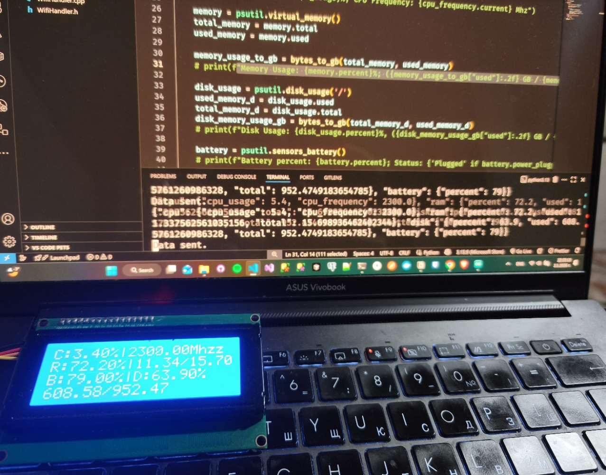

# Project Description

Arduino PC Monitor is a real-time system performance dashboard powered by an Arduino R4 WiFi. It allows you to monitor your computer's vital statistics—such as CPU usage, clock speed, RAM and HDD/SSD memory consumption—on an external LCD screen. I am on laptop and I also added battery percentage.



# How it works

The system operates using a client-server architecture over a local WiFi network:

1.  **Data Collection (PC):** A Python script utilizes the `psutil` library to constantly fetch system metrics (CPU load, CPU frequency in MHz, and RAM usage).
2.  **Transmission:** The script opens a socket connection and sends the data as JSON packets directly to the Arduino, which is running a TCP server on port **8080**.
3.  **Visualization (Arduino):** The Arduino R4 WiFi receives the stream, parses the JSON using `ArduinoJson`, and renders the statistics onto a **LiquidCrystal I2C display**. It also utilizes the R4's built-in **LED Matrix** for visual status indicators.

# Key features

- **Wireless Monitoring:** Eliminates data cables between the PC and the display unit.
- **Direct TCP Socket:** Uses Python's `socket` library for low-latency, real-time data streaming.
- **Dedicated Hardware:** Offloads monitoring visuals to an external I2C LCD screen.
- **R4 WiFi Integration:** Leverages the ESP32 module on the Arduino R4 for seamless WiFi connectivity.

# Libraries Used

| Library                | Purpose in Project                                                                             |
| :--------------------- | :--------------------------------------------------------------------------------------------- |
| **psutil** (Python)    | Retrieves PC system metrics (CPU usage, frequency, RAM and HDD/SSD) to be sent to the Arduino. |
| **WiFiS3**             | Connects the Arduino R4 WiFi to the network and hosts the web server on port 8080.             |
| **ArduinoJson**        | Parses the JSON data packets sent from the Python script to the Arduino.                       |
| **LiquidCrystal_I2C**  | Drives the LCD screen to visualize the received PC stats.                                      |
| **Arduino_LED_Matrix** | Controls the built-in LED matrix on the Arduino R4.                                            |

# Components Used

- **Arduino R4 Wifi**
- **20x4 I2C LCD Display**
- **4 Male to female jumper wires**
- **USB-C Cable (for power/upload)**

## Wiring

Connect the LCD to the Arduino R4 as follows:

- **VCC** -> 5V
- **GND** -> GND
- **SDA** -> SDA pin
- **SCL** -> SCL pin

# How to test the project if you want

To get the system running, you need to set up the Arduino server first, then start the Python client on your PC.
Before uploading the code, ensure you have the Arduino IDE installed and the Arduino UNO R4 WiFi board package downloaded.

## 1. Arduino Setup

1.  Install Libraries

Open the Arduino IDE, go to Sketch -> Include Library -> Manage Libraries, and install the following:

- Arduino_LED_Matrix
- WiFiS3
- LiquidCrystal_I2C
- ArduinoJson

2. Configure Network

In the **_pc_monitor_** folder you have to create **_arduino-secrets.h_** file where you should put your Wifi SSID and Password. It should work like this:

```cpp
   #define SECRET_SSID "Your Wifi SSID"
   #define SECRET_PASS "Your Wifi Password"
```

3. Upload Code

Connect your Arduino R4 WiFi via USB and upload the sketch.

4. Get IP Address:
   Open the Serial Monitor (set baud rate to match your code, usually 9600 or 115200). Once connected, the Arduino will print its assigned IP Address (e.g., 192.168.1.15). Note this down.

## 2. Python Client Setup

The Python script runs on the PC you want to monitor. It fetches the data and pushes it to the Arduino.

1. Install Python: Ensure you have python installed
2. Install Dependencies: Open your terminal or command prompt and install the psutil and requests libraries:

```bash
   pip install psutil
```

3. Configure secret varibles: In the **_pc*monitor*_** folder you have to create **_*secret_varibles.py*_** file where you should put the following data:

```python
    arduino_ip = "The arduino board ip address"
    port = 8080
```

4. Run the script: Again in the **_pc_monitor_** folder you should run the **_system_monitor.py_** script:

```bash
python system_monitor.py

```
